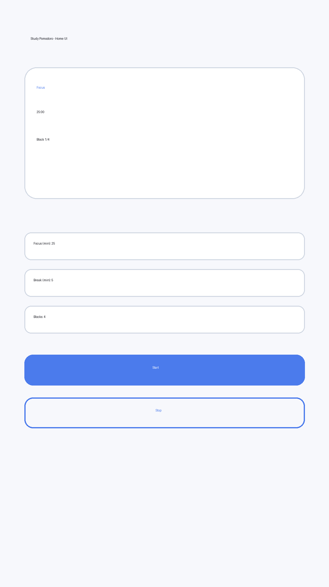

# Study Pomodoro (Android Java)

A full Android Studio project (Java + XML Views) for managing study time with Pomodoro sessions, Firebase authentication, daily reminders, and statistics tracking.

## Features
- Splash / Welcome screen
- Login / Register using Firebase Authentication
- User profile save (name + email) in Cloud Firestore
- Custom Pomodoro timer:
  - Focus Time
  - Break Time
  - Blocks
  - Automatic Focus/Break transitions until completion
- Daily reminder time with AlarmManager + local Notification
- Statistics dashboard:
  - Completed sessions
  - Total focus minutes
  - Average focus minutes
  - Last used session settings
- Session settings and profile/reminder screens

## Tech stack
- Java (Android)
- Android Views/XML
- Material Design 3 components
- SharedPreferences (local settings and local stats)
- Firebase Auth + Firestore (user/cloud study data)

## Project structure
- `app/src/main/java/com/majd/pomodoro`
  - Activities: `SplashActivity`, `LoginActivity`, `HomeActivity`, `SessionSettingsActivity`, `StatisticsActivity`, `ProfileReminderActivity`
  - Core: `PomodoroEngine`, `PrefsManager`, `FirebaseRepository`
  - Reminder: `ReminderScheduler`, `ReminderReceiver`
- `app/src/main/res/layout`
  - XML layouts for all screens

## Firebase setup (required)
1. Create a Firebase project.
2. Add an Android app with package name:
   - `com.majd.pomodoro`
3. Download `google-services.json` and place it in:
   - `app/google-services.json`
4. Enable in Firebase Console:
   - Authentication > Email/Password
   - Cloud Firestore
5. Build and run in Android Studio.

> Note: The source code is prepared for Firebase SDK usage. If you add the Google Services Gradle plugin in your environment, keep the `google-services.json` file present.

## Build & run
Open the repository in Android Studio and run the app on an emulator/device.

If you have Android SDK configured locally, typical commands are:
```bash
./gradlew assembleDebug
./gradlew test
```

## Reminder behavior
- User sets a daily reminder time in Profile/Reminder screen.
- App schedules an `AlarmManager` daily alarm.
- `ReminderReceiver` posts local notification at the chosen time.

## Data model (Firestore)
- Collection: `users/{uid}`
  - `name`, `email`, `createdAt`
- Collection: `study_stats/{uid}`
  - `lastFocusMin`, `lastBreakMin`, `lastBlocks`
- `sessionsCompleted`, `totalFocusMin`, `averageFocusMin`
- `reminderHour`, `reminderMinute`, `updatedAt`

## UI preview

